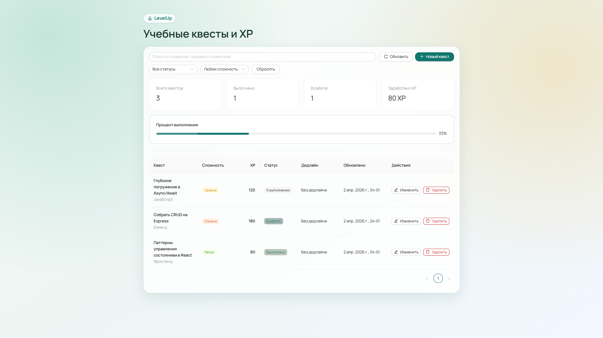
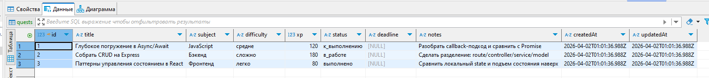

# LevelUp API + React






## 1. Назначение проекта

Учебный CRUD-проект для практики клиентских запросов `GET / POST / PUT / DELETE`.

Стек:

- Frontend: React + Ant Design
- Backend: Express + SQLite
- Валидация: ручная (без zod)

## 2. Быстрый запуск

Из корня проекта:

```bash
npm install
npm run dev
```

Сервисы:

- Frontend: `http://localhost:5173`
- Backend: `http://localhost:3000`

Отдельно:

```bash
npm run dev:server
npm run dev:client
```

## 3. Полезные пути в коде

Backend:

- Роуты: `server/src/routes/questRoutes.js`
- Контроллеры: `server/src/controllers/questController.js`
- Сервисы: `server/src/services/questService.js`
- Модель (SQL): `server/src/models/questModel.js`
- Валидация: `server/src/validators/questValidators.js`

Frontend:

- HTTP-клиент: `client/src/api/apiClient.js`
- API сущности: `client/src/api/questApi.js`
- CRUD-хук: `client/src/features/quests/hooks/useQuestBoard.js`
- Форма + таблица: `client/src/features/quests/components/*`

## 4. Сущность `quest`

Поля:

- `id`: number
- `title`: string
- `subject`: string
- `difficulty`: `легко | средне | сложно`
- `xp`: integer
- `status`: `к_выполнению | в_работе | выполнено`
- `deadline`: `YYYY-MM-DD` или `null`
- `notes`: string
- `createdAt`: ISO datetime
- `updatedAt`: ISO datetime

## 5. Правила валидации

Тело `POST/PUT`:

- `title`: строка, 3..100
- `subject`: строка, 2..50
- `difficulty`: только `легко | средне | сложно`
- `xp`: целое число, 10..500
- `status`: только `к_выполнению | в_работе | выполнено`
- `deadline`: пусто/`null`/`YYYY-MM-DD`
- `notes`: строка, до 500 (опционально)

Параметры:

- `:id`: положительное целое число

Фильтры `GET /api/quests`:

- `status`: одно из значений статуса
- `difficulty`: одно из значений сложности
- `search`: строка до 100 символов

## 6. Эндпоинты (полный список)

### 6.1 Healthcheck

- `GET /api/health`
- Назначение: проверить, что API запущен
- Успех: `200`

Пример ответа:

```json
{
    "success": true,
    "message": "API работает стабильно",
    "data": {
        "uptime": 12.34,
        "timestamp": "2026-04-02T09:00:00.000Z"
    }
}
```

### 6.2 Получить список квестов

- `GET /api/quests`
- Query (опционально): `status`, `difficulty`, `search`
- Успех: `200`

Пример:

- `/api/quests?status=в_работе`
- `/api/quests?difficulty=сложно&search=React`

### 6.3 Получить квест по id

- `GET /api/quests/:id`
- Успех: `200`
- Ошибки: `400` (невалидный id), `404` (квест не найден)

### 6.4 Создать квест

- `POST /api/quests`
- Тело: JSON (см. правила валидации)
- Успех: `201`
- Ошибки: `400` (валидация)

### 6.5 Обновить квест

- `PUT /api/quests/:id`
- Тело: JSON (полный объект)
- Успех: `200`
- Ошибки: `400`, `404`

### 6.6 Удалить квест

- `DELETE /api/quests/:id`
- Успех: `200`
- Ошибки: `400`, `404`

## 7. Пример тела для POST/PUT

```json
{
    "title": "Собрать CRUD на Express",
    "subject": "Бэкенд",
    "difficulty": "сложно",
    "xp": 180,
    "status": "в_работе",
    "deadline": "2026-04-10",
    "notes": "Сделать разделение: route/controller/service/model"
}
```

## 8. Формат ответов API

### Успех

```json
{
    "success": true,
    "message": "Квест создан",
    "data": {}
}
```

### Ошибка валидации

```json
{
    "success": false,
    "message": "Ошибка валидации",
    "error": [
        {
            "path": "title",
            "message": "Поле \"title\" должно содержать минимум 3 символа(ов)"
        }
    ]
}
```

### Ошибка 404

```json
{
    "success": false,
    "message": "Квест не найден"
}
```

## 9. HTTP-коды, которые показывает проект

- `200`: успешный GET/PUT/DELETE
- `201`: успешный POST
- `400`: ошибка валидации (body/query/params)
- `404`: не найден маршрут или сущность
- `409`: нарушение SQL-ограничения
- `500`: внутренняя ошибка

## 10. Сценарий демонстрации (10-15 минут)

1. `GET /api/health` — показать проверку доступности API.
2. `GET /api/quests` — показать чтение списка.
3. `POST /api/quests` — создать запись.
4. `PUT /api/quests/:id` — обновить статус/сложность.
5. `DELETE /api/quests/:id` — удалить запись.
6. Отправить невалидный `POST` и разобрать ответ `400`.
